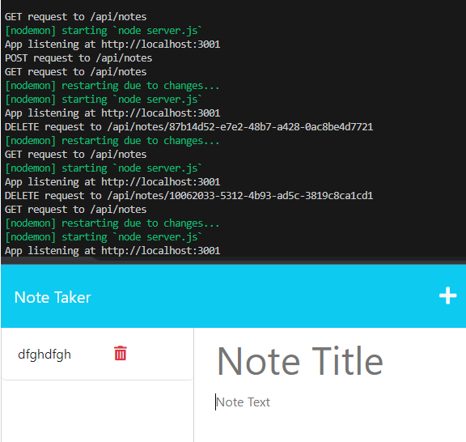

# Note Taker
  ## Description
  Create, view and delete notes with titles.
  
  ## Table of Contents

  [Installation](#installation)
  
  [Usage](#usage)
  
  [License](#license)
  
  [Contributing](#contributing)
  
  [Tests](#tests)
  
  [Questions](#questions)

  ## Installation
  Simply open the folder up with VS Code. Advised to be using Node Monitor. Launch server.js with nodemon. Once running access the page using http://localhost:3001

  ## License
  

  https://opensource.org/licenses/MIT

  Copyright 2023 kylatae

     
        Permission is hereby granted, free of charge, to any person obtaining a copy of this software and associated documentation files (the “Software”), to deal in the Software without restriction, including without limitation the rights to use, copy, modify, merge, publish, distribute, sublicense, and/or sell copies of the Software, and to permit persons to whom the Software is furnished to do so, subject to the following conditions:
        
        The above copyright notice and this permission notice shall be included in all copies or substantial portions of the Software.

        THE SOFTWARE IS PROVIDED “AS IS”, WITHOUT WARRANTY OF ANY KIND, EXPRESS OR IMPLIED, INCLUDING BUT NOT LIMITED TO THE WARRANTIES OF MERCHANTABILITY, FITNESS FOR A PARTICULAR PURPOSE AND NONINFRINGEMENT. IN NO EVENT SHALL THE AUTHORS OR COPYRIGHT HOLDERS BE LIABLE FOR ANY CLAIM, DAMAGES OR OTHER LIABILITY, WHETHER IN AN ACTION OF CONTRACT, TORT OR OTHERWISE, ARISING FROM, OUT OF OR IN CONNECTION WITH THE SOFTWARE OR THE USE OR OTHER DEALINGS IN THE SOFTWARE.

  ## Contributing
  Currently this is a solo project but any further contribution on more ideal ways of formatting or adding in time stamps, calender reminders etc.

  ## Questions
  Please contact me using my github page at https://www.github.com/kylatae

  ## Preview Page

[Video Example Link](./lib/vid/) 

Repo Link:[https://www.github.com/kylatae/note-taker/](https://www.github.com/kylatae/note-taker)
